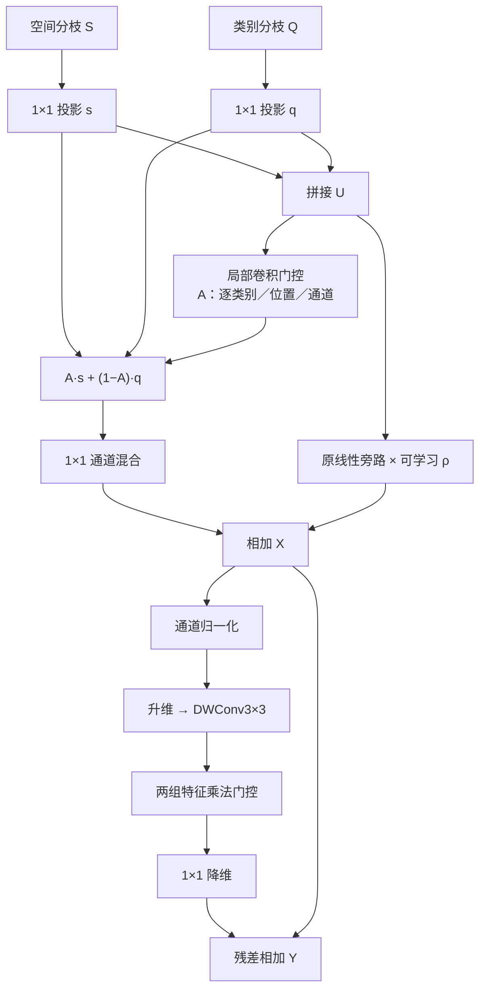

# 原版 DualFeatureMoE 的可学习轻量融合修改建议

日期：2026-09-27。对象：当前 PCA-Seg 遥感开放词汇分割工程，以原版四个 3×3 专家的 DualFeatureMoE 为预算基准。本文方案已完成代码与配置适配；仅做静态核对，未在本机运行模型测试，未改动论文。

## 1. 首选方案

**建议用“逐类别、逐位置、逐通道的可学习分枝门控＋卷积门控前馈网络”整体替换原 DualFeatureMoE。**

工作名称为 **LearnedDualFeatureFusion**，中文称“可学习双分枝门控融合”。它将原来四个专家的计算预算重新分配给两个学习过程：

1. **学习如何组合两路输入。** 用小型卷积网络直接预测空间分枝与类别分枝的融合权重。
2. **学习如何加工融合结果。** 用包含深度卷积和乘法门控的前馈网络进行联合特征变换。

新模块采用卷积实现，借鉴 Transformer 中的门控前馈结构，保持原输入输出接口。原 MoE 的专家列表和专家 softmax 被移除，因此新模块按特征融合网络命名。

默认 C=128 时：

| 单模块预算 | 原版 DualFeatureMoE | 建议方案 | 相对变化 |
|---|---:|---:|---:|
| 可训练参数 | 349,221 | **342,657** | **−1.88%** |
| 每个类别／空间位置的主要卷积 MAC | 345,216 | **339,200** | **−1.74%** |

这些是依据完整层定义计算的理论值。实现已接入，精度、显存和实际延迟需在服务器验证。

## 2. 本版需要满足的设计约束

上一版 RSStructureDualFeatureMoE 为专家指定了中心、细节、区域、方向功能，并使用相似性温度、方向配对及有界校正。本版从原版重新设计，按用户的新要求，将特征处理交给网络学习。

| 项目 | 本版处理 |
|---|---|
| 邻域相似度温度 τ | 不使用；邻域信息由可学习卷积编码 |
| 手工高通、均值差、方向成对规则 | 不使用；局部响应由深度卷积学习 |
| 专家职责与固定功能划分 | 不使用；融合后的中间通道自由学习 |
| 校正幅度上界、手设更新比例 | 不新增；门控前馈输出经残差加入 |
| 指导特征 detach 开关 | 不使用；融合路径端到端反向传播 |
| Top-k、路由负载损失、窗口／方向数量 | 新模块不引入这些配置 |
| 模块接口与候选类别维 T | 保留 `[B,C,T,H,W] → [B,C,T,H,W]` |
| 原残差比例 ρ | 沿用原可学习标量及 0.5 初始值，不增加上下界或搜索范围 |
| 新实验配置 | 仅切换融合类型；通道宽度和训练协议沿用原配置 |

卷积核大小、隐藏宽度、归一化形式仍是必要的**网络结构选择**。本版固定普通 3×3 卷积和按预算确定的 4C 隐藏宽度，不声称“没有任何超参数”。LayerNorm 的数值稳定常数和权重初始化属于实现约定，不作为遥感先验调参项。

当前 KL 教师本身的温度、损失权重等训练配置继续保留；本要求针对新增融合模块。

## 3. 原版结构与遥感适配位置

### 3.1 原版究竟融合什么

[原版实现](/Users/leopold/Developer/open/PCA-Seg-Remote/cat_seg/modeling/transformer/model.py:548) 的两路输入为：

- S：空间聚合输出。
- Q：类别聚合输出。
- 二者均为 `[B,C,T,H,W]`，T 是候选类别数，且二者已经包含上游注意力上下文。

它们不是一组高低分辨率特征，也不是 RGB／深度等不同传感器输入。融合前将 B、T 合并，随后执行二维卷积。

原版每个专家采用：

```text
Conv1×1(2C→2C) → SyncBN → GELU
→ GroupConv3×3(2C→C, groups=C) → GELU
```

四个专家全部执行，原门控输出 `[BT,4,H,W]`，每个位置的专家系数由该专家所有输出通道共享。两路特征主要在专家内部隐式融合。

新方案将门控对象改为**两条输入分枝**，输出权重形状为 `[BT,C,H,W]`。它能够在同一位置对不同通道选择不同的两路贡献，再由联合卷积网络处理融合结果。

### 3.2 遥感适配如何落实

| 遥感与项目特点 | 结构上的对应处理 | 需要验证的作用 |
|---|---|---|
| 密集目标、小目标和背景相邻 | 门控保持 H×W 分辨率，读取可学习 3×3 邻域；不把整图汇总成一个融合系数 | 局部目标能否获得不同于大面积背景的分枝权重 |
| 建筑、道路、船舶等局部形态不同 | 融合后采用学习型深度卷积与通道乘法交互 | 能否学习对轮廓、纹理和区域内部有用的不同响应 |
| 目标朝向多变 | 使用完整 3×3 学习型卷积，并保留工程已有四方向编码 | 能否在既有方向信息上学习有效融合；本模块不承诺严格旋转等变 |
| 开放词表、T 随评估集变化 | 所有参数按类别共享，门控逐类别计算，不引入固定类别数的线性层 | 可变 T、类别重排和跨数据集推理是否正常 |
| 上游已提供空间／类别上下文 | 新模块集中处理局部组合与联合变换 | 避免在每个候选类别上重复增加全空间自注意力 |
| 分割训练每卡样本有限 | 前馈网络采用逐位置通道 LayerNorm | 减少对融合模块中跨 batch／类别统计的依赖；效果通过归一化对照判断 |

这是在遥感任务约束下组织可学习网络的方案。卷积与门控本身是通用组件，遥感适配是否有效，应由小目标、细长结构、方向和跨数据集结果支撑。

## 4. 相关工作与采用范围

| 一手来源 | 支持的机制 | 本版采用范围 |
|---|---|---|
| [Attentional Feature Fusion，WACV 2021](https://openaccess.thecvf.com/content/WACV2021/html/Dai_Attentional_Feature_Fusion_WACV_2021_paper.html)，[论文](https://arxiv.org/html/2009.14082v2) | 通过学习型注意力控制分枝融合 | 借鉴内容相关的两路加权；本版以完整分辨率的局部卷积生成权重，不直接移植 AFF 的局部／全局双分枝结构 |
| [Restormer，CVPR 2022，§3.2](https://arxiv.org/html/2111.09881v1)，[作者实现](https://github.com/swz30/Restormer/blob/main/basicsr/models/archs/restormer_arch.py) | GDFN 通过点卷积、深度卷积、GELU 和逐元素乘法控制特征变换 | 将这类前馈算子用于两路特征融合后的联合加工；不引入其 MDTA 注意力、注意力温度和完整骨干 |
| [UNetFormer，ISPRS 2022](https://arxiv.org/abs/2109.08937)，[作者实现](https://github.com/WangLibo1995/GeoSeg/blob/main/geoseg/models/UNetFormer.py) | 在遥感语义分割中结合局部细节、上下文建模和特征细化 | 支持局部学习型细化的任务动机；当前接口为同分辨率的类别条件特征，因此另行设计融合入口 |
| [RSKT-Seg，RS-CMA／RS-Fusion](https://arxiv.org/html/2509.12040v1) | 遥感开放词汇任务结合多方向代价图及空间／类别关系 | 保留现有方向和词表处理，模块参数不绑定训练类别 |
| [EfficientViT，CVPR 2023](https://openaccess.thecvf.com/content/CVPR2023/html/Liu_EfficientViT_Memory_Efficient_Vision_Transformer_With_Cascaded_Group_Attention_CVPR_2023_paper.html) | 强调注意力中的访存、张量变换和实际速度问题 | 预算验收同时测量运行耗时；不将接近的 MAC 当作相同速度 |

具体适配为：**逐类别的局部分枝门控＋完整双特征线性旁路＋按原模块预算配置的门控前馈变换**。其中 GDFN 形式属于已有机制，新增组合的价值通过与原版及简化对照比较。

## 5. 完整目标结构

### 5.1 输入投影

合并 B、T 后，两路特征为 `[BT,C,H,W]`：

\[
s=P_s(S),\qquad q=P_q(Q),\qquad U=[s;q].
\]

两个投影均为 C→C 的 1×1 卷积，与原版相同。U 为 `[BT,2C,H,W]`。

### 5.2 学习型分枝门控

\[
L=D_g^{3\times3}(U),
\qquad
A=\sigma\left(W_{g2}\operatorname{GELU}(W_{g1}L)\right).
\]

对应网络：

```text
U：2C 通道
→ DWConv3×3：2C→2C，groups=2C
→ Conv1×1：2C→C
→ GELU
→ Conv1×1：C→C
→ Sigmoid
→ A：[BT,C,H,W]
```

这里的深度卷积按输入通道学习邻域响应，随后的 1×1 卷积联合读取两路特征。A 随候选类别、位置和通道变化；sigmoid 使用标准定义，不增加温度参数。

先在当前位置融合两路值，再作通道混合：

\[
V=P_v\left(A\odot s+(1-A)\odot q\right),
\]

其中 \(P_v:C\to C\) 为 1×1 卷积。门控生成时读取邻域，而这条值路径直接读取当前位置的 s、q，以保留局部响应。

投影后的 s、q 没有被假定为已对齐的同一语义坐标；\(P_s,P_q,P_v\) 随分割任务共同学习。融合前 FOD 继续作用于原始 S、Q，不用跨分枝相似度判断二者是否可靠。

### 5.3 完整双特征旁路

\[
X=V+\rho P_r(U).
\]

\(P_r:2C\to C\) 和可学习 \(\rho\) 沿用原版，ρ 初始为 0.5。它们为两路输入保留直接的线性组合路径。

即使 A 倾向其中一路，另一条分枝仍可通过 \(P_r(U)\) 贡献信息；整个模块的表达能力不局限于两个输入的凸组合。

### 5.4 卷积门控前馈变换

令隐藏宽度 \(m=4C\)，定义：

\[
[H_1;H_2]=D_f^{3\times3}\left(W_{\mathrm{in}}\operatorname{LN}_C(X)\right),
\]
\[
\Delta=W_{\mathrm{out}}\left[\operatorname{GELU}(H_1)\odot H_2\right],
\qquad
Y=X+\Delta.
\]

其中：

- \(W_{\mathrm{in}}:C\to2m\) 为 1×1 卷积。
- \(D_f\) 为 2m 通道的 3×3 depthwise 卷积。
- \(H_1,H_2\) 各为 m 通道。
- \(W_{\mathrm{out}}:m\to C\) 为 1×1 卷积。
- \(\operatorname{LN}_C\) 仅沿每个位置的 C 个通道归一化，带可学习 weight／bias。

两组中间特征的职责由训练形成，不指定其中哪组负责边界或方向。\(H_2\) 是无 sigmoid 限幅的学习型调制特征，可以产生正负响应；它与前面 A 的两路融合比例是两个不同层面的门控。

C=128 时，这一部分为：

```text
X：128 通道
→ Channel LayerNorm
→ Conv1×1：128→1024
→ DWConv3×3：1024→1024，groups=1024
→ 按通道拆成 512＋512
→ GELU(第一组) × 第二组
→ Conv1×1：512→128
→ 加回 X
```

最后将 Y 恢复为 `[B,C,T,H,W]`。四个原融合位置各使用一套独立模块参数。

### 5.5 框架图与接口伪代码



```python
# Interface sketch; all helper layers are defined by Sections 5.1–5.4.
def forward(spatial_feat, class_feat, batched_inputs=None):
    s = self.spatial_proj(fold_class(spatial_feat))
    q = self.class_proj(fold_class(class_feat))
    u = torch.cat((s, q), dim=1)
    a = torch.sigmoid(self.gate_out(
        F.gelu(self.gate_in(self.gate_dw(u)))
    ))
    v = self.value_proj(a * s + (1 - a) * q)
    x = v + self.res_scale * self.residual(u)
    h1, h2 = self.ffn_dw(self.expand(channel_norm(x))).chunk(2, dim=1)
    delta = self.reduce(F.gelu(h1) * h2)
    return restore_class(x + delta)
```

实现固定约定：全部 Conv2d 使用 bias=True；3×3 卷积 stride=1、padding=1、dilation=1，沿用原版默认零填充；前馈通道 LayerNorm 使用 affine=True、eps=1e-5。采用框架默认卷积初始化；不新增 LayerScale、DropPath 或额外门控温度。

通道归一化可将 `[BT,C,H,W]` 移为 `[BT,H,W,C]` 后使用 `nn.LayerNorm(C)` 再移回。`GroupNorm(1,C)` 会同时归一化空间维，不能作为这一公式的直接替代。

## 6. 计算预算推导

### 6.1 对齐原版

令 N=BTHW、E=4、d=floor(C/4)。原版所有卷积的主要 MAC 为：

\[
M_{\mathrm{base}}/N=20C^2+72C+2Cd+4d.
\]

可训练参数包含卷积偏置、SyncBN 仿射参数及残差标量：

\[
P_{\mathrm{base}}=M_{\mathrm{base}}/N+31C+d+5.
\]

新模块的主要 MAC 分解如下：

| 部件 | 每位置 MAC | C=128、m=512 |
|---|---:|---:|
| 两路输入投影 | 2C² | 32,768 |
| 门控深度卷积 | 18C | 2,304 |
| 门控两层点卷积 | 3C² | 49,152 |
| 值融合后的点卷积 | C² | 16,384 |
| 原双特征残差投影 | 2C² | 32,768 |
| 前馈升维 C→2m | 2Cm | 131,072 |
| 前馈深度卷积 | 18m | 9,216 |
| 前馈降维 m→C | Cm | 65,536 |
| **合计** | **8C²+18C+3Cm+18m** | **339,200** |

### 6.2 隐藏宽度由预算确定

在 C=128 时，令新旧主要 MAC 相等，可解得 m≈527。本版采用规整的 **m=4C=512**，与预算相差约 1.74%，保留方便实现的通道组织。

该宽度由原模块预算推导，不按数据集的目标大小、方向或类别数量设定。首轮不将其加入超参数搜索。

代入 m=4C：

\[
M_{\mathrm{new}}/N=20C^2+90C.
\]

全部卷积偏置合计为 25C，LayerNorm 仿射参数为 2C，另有原残差标量 1 个，因此：

\[
P_{\mathrm{new}}=20C^2+117C+1.
\]

四个融合模块的总参数由 **1,396,884** 变为 **1,370,628**。B=1、T=15、H=W=24、4 次融合时，主要卷积量由 **11.931 GMAC** 变为 **11.723 GMAC**；按 1 MAC=2 FLOPs，分别为约 23.861 和 23.446 GFLOPs。其他输入按实际 B、T、H、W 重算。

### 6.3 完整计算量和实际效率

上述 MAC 不计归一化、GELU／sigmoid、逐元素乘法／加法、布局变换。新方案额外存在 A 的融合运算和 m 通道乘法门控，原版则存在四专家加权、softmax、四组 SyncBN 和对应激活；应在服务器按相同口径补齐统计。

主导项均为 \(O(BTHWC^2)\)，没有新增 \(T^2\) 或 \((HW)^2\) 的注意力矩阵。计算量接近原版，同时新模块没有融合内部的 SyncBN 通信。实际速度仍受到深度卷积、LayerNorm 布局及设备算子实现影响。

m=4C 时前馈升维输出达到 8C 通道。原版四专家的中间特征合计也含 8C 通道，但缓存、执行顺序和反向保存方式不同，因此不能据此认定训练显存相同。

建议工程验收：完整模块 FLOPs 与原版差异控制在 5% 左右；同时报告模块前向／反向延迟、整网吞吐和训练峰值显存。5% 是本项目的预算检查范围，不是模型参数。

## 7. 为什么本版先采用卷积实现

已有空间聚合与类别聚合分枝负责上下文建模。新模块用卷积学习局部融合，再用门控前馈处理通道交互，能够把计算预算集中在当前融合问题上。

额外全空间注意力会引入与 \((HW)^2\) 相关的计算和激活；窗口注意力则需要额外确定窗口与边界处理。它们可以另立实验，但当前没有证据表明已有上下文分枝仍不足，因此首版采用上述唯一结构。

本模块没有 self-attention，不能把 GDFN 单独称为完整 Transformer。它是一种结合学习型卷积门控和 Transformer 风格前馈算子的融合网络。

## 8. 已完成的工程接入

| 位置 | 接入情况 |
|---|---|
| [新增模块](cat_seg/modeling/transformer/learned_dual_feature_fusion.py) | 实现 `LearnedDualFeatureFusion(dim)`，只暴露与原聚合器相同的通道入口 |
| [模块工厂](/Users/leopold/Developer/open/PCA-Seg-Remote/cat_seg/modeling/transformer/model.py:626) | 新增 `learned_dual_feature_fusion` 类型，构造 `LearnedDualFeatureFusion(dim)` |
| [配置注册](/Users/leopold/Developer/open/PCA-Seg-Remote/cat_seg/config.py:104) | 沿用现有 FEATURE_FUSION.TYPE，无需修改注册；不新增先验配置节点 |
| [Predictor 配置传递](/Users/leopold/Developer/open/PCA-Seg-Remote/cat_seg/modeling/transformer/cat_seg_predictor.py:192) | 已核对现有 type 传递；新类型不读取其他融合类型的参数，无需修改 Predictor |
| [AggregatorLayer](/Users/leopold/Developer/open/PCA-Seg-Remote/cat_seg/modeling/transformer/model.py) | 保持 first／second 调用和普通密集模块返回约定；当前两层共替换四处 |
| [新增 KL 配置](configs/clip_vitb_384_isaid_attr64_semantic_kl_learned_fusion.yaml) | 继承现有 KL 协议，设置新融合类型、空模型恢复路径及独立输出目录 |

配置如下：

```yaml
_BASE_: clip_vitb_384_isaid_attr64_semantic_kl.yaml
MODEL:
  WEIGHTS: ""
  SEM_SEG_HEAD:
    FEATURE_FUSION:
      TYPE: "learned_dual_feature_fusion"
OUTPUT_DIR: "output/isaid_clip_vitb_semantic_kl_learned_fusion"
```

父 KL 配置目前启用多尺度 MoE，新类型覆盖 TYPE 后不读取其核列表。新配置直接继承 KL 协议，不继承 RS_STRUCTURE_MOE 实验配置。

保持原 KL／RSDINO 蒸馏、属性库、RS prompts、四方向编码、训练步数与优化器。FOD 继续约束融合前分枝，沿用聚合端 0.001 权重；不新增融合辅助损失。

训练采用相同预训练骨干与重新初始化的融合头。新结构的参数层级、尺寸和归一化发生变化，旧 MoE checkpoint 不能作为完整断点直接恢复。

服务器准备好原有依赖、数据和教师权重后，从仓库根目录启动。例如使用两张 GPU：

```bash
python train_net.py --num-gpus 2 \
  --config-file configs/clip_vitb_384_isaid_attr64_semantic_kl_learned_fusion.yaml
```

首次训练不传 `--resume`；后续只恢复本版结构在对应输出目录产生的 checkpoint。此命令尚未在本机执行。

## 9. 最小验证计划

### 9.1 先比较完整模型，再解释改进来源

| 编号 | 实验 | 目的 |
|---|---|---|
| B0 | 原版 DualFeatureMoE，四个 3×3，同一 KL 协议 | 建立预算与精度基线 |
| L0 | 完整 LearnedDualFeatureFusion | 判断新方案是否值得采用 |
| A1 | L0 的 A 固定为 0.5，其余结构保留 | 测量学习型分枝门控的作用 |
| A2 | L0 的门控 DWConv3×3 旁路，门控点卷积保留 | 判断生成融合权重时局部邻域是否有用 |
| A3 | L0 的前馈深度卷积旁路，两个点投影和乘法保留 | 判断融合后局部变换是否有用 |

运行 B0 时，必须显式设置 `MODEL.SEM_SEG_HEAD.FEATURE_FUSION.TYPE: "dual_feature_moe"`。直接使用当前父 KL 配置会运行多尺度版本，不能作为本文的原版基线。

先用同种子完成 B0／L0；L0 有优势后再进行至少三个配对种子和单项消融。A1–A3 不用于声称严格同计算量，仅用于分离机制。旁路的专有参数应冻结或移除，避免分布式训练的未使用参数问题。

若结果主要表现为训练稳定性变化，增加原版 SyncBN→逐位置通道 LayerNorm 的对照，区分归一化与新融合结构的作用。无需首轮同时增加所有实验。

### 9.2 质量与工程检查

- 同一评估协议下报告平均 mIoU、标准差和逐类别 IoU；统一 checkpoint 选择规则。
- 分析小目标／连通域、细长结构和边界指标，同时保持跨数据集开放词汇评估。分组阈值用于评估，不加入模型。
- 记录 A 的分布、两路梯度以及前馈输出相对 X 的幅度，检查门控饱和、分枝长期被忽略或前馈异常放大。
- 验证不同 T 和类别重排后的对应输出；确认 LayerNorm 只沿 C 归一化。
- 在服务器检查 AMP 前向、梯度有限性、四个融合实例及参数统计；核对 C=128 时每模块 342,657 参数。
- 统一设备、输入、精度和 batch，预热并同步 GPU 后报告实际耗时和峰值显存。

原 24×24 网格已经丢失的细节无法靠融合模块完整恢复。本版检验的是现有两路信息能否被更有效地利用。采用条件为：主 mIoU 的提升具有配对实验支持，同时满足计算预算；尚不预设提升幅度。

## 10. 后续验证

已实现本文的 **局部分枝门控＋双特征旁路＋4C 门控前馈**。下一步在服务器按原 KL 协议完成 B0／L0 比较，再决定是否开展消融。

本方案的核心改进是让网络学习“两路特征在什么位置、哪些通道上应如何组合，以及组合后怎样变换”，将原四专家预算用于更细粒度的融合，同时减少需要人为设定的遥感处理规则。
