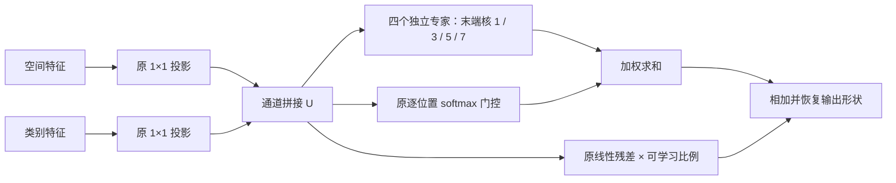

# DualFeatureMoE 多尺度卷积专家修改指南

日期：2026-09-24。依据：当前工作区源码、相关论文正文与作者实现。

**建议保留原 DualFeatureMoE 的四专家、双分枝投影、空间门控和线性残差，仅把四个专家末端的 3×3 分组卷积分别替换为 1×1、3×3、5×5、7×7。** 四个专家继续读取完整的双特征拼接输入，并按原门控权重合成输出。该方案有多尺度卷积与自适应尺度选择的文献依据，适合作为第一轮受控实验。

本次交付仅为修改指南，未实施模型或配置变更，也未修改论文。下文的配置项、类型名和代码片段均为后续实施约定；精度、显存与延迟需要在项目训练环境中验证。

## 1. 当前代码与改造位置

### 1.1 原模块的实际结构

实现位于 [model.py:547](/Users/leopold/Developer/open/PCA-Seg-Remote/cat_seg/modeling/transformer/model.py:547)。两路输入为 `[B,C,T,H,W]`，其中 `T` 为候选类别维，不是时间或属性数。模块先将 `B,T` 合并成 `[BT,C,H,W]`，再执行二维卷积。

当前每个专家的结构为：

```text
Conv1×1(2C → 2C)
→ SyncBatchNorm(2C)
→ GELU
→ GroupConv3×3(2C → C, groups=C, padding=1)
→ GELU
```

需要替换的准确位置是 `expert_layers[i][3]`。前面的 `expert_layers[i][0]` 是混合通道的 1×1 卷积，第一轮保持不变。

| 代码事实 | 对修改的要求 |
|---|---|
| 四个专家结构相同、参数独立 | 原模型已能学到不同变换；多尺度改造增加的是结构上的尺度差异，不能仅凭结构断言原专家已退化为相同输出 |
| 末端卷积为 `2C→C, groups=C` | 每组处理 2 个输入通道、输出 1 个通道；不能按普通 `C→C` depthwise 卷积实现或核算 |
| 专家前的 1×1 卷积读取全部 2C 通道 | 分组卷积的两个输入通道已混合两分枝信息，不对应固定的一对空间／类别通道 |
| 所有专家都计算，再按 softmax 加权 | 改造后仍为密集软混合，不产生 Top-k 跳过计算的收益 |
| 门控输出为 `[BT,4,H,W]` | 不同类别、不同位置可使用不同尺度权重；同一专家的输出通道共享该位置的权重 |
| 两个输入投影和残差投影均为 1×1 | 保留它们可将首轮实验变化限制在专家的空间卷积尺度 |
| `res_scale` 初值为 0.5，是可学习标量 | 保留原参数及初始化，不额外施加 sigmoid 或归一化 |

卷积不直接沿 `T` 交换信息；训练时 SyncBatchNorm 的统计会汇总 `BT`、空间位置与同步进程。因而“按类别运行卷积”不等于训练阶段各类别完全独立。

### 1.2 调用链与影响范围

调用链为：

```text
配置 FEATURE_FUSION
→ CATSegPredictor.from_config
→ Aggregator
→ 每个 AggregatorLayer 的 first / second 两个融合模块
→ build_feature_fusion
→ DualFeatureMoE
```

对应入口：

- [配置注册：config.py:101](/Users/leopold/Developer/open/PCA-Seg-Remote/cat_seg/config.py:101)。
- [配置读取：cat_seg_predictor.py:192](/Users/leopold/Developer/open/PCA-Seg-Remote/cat_seg/modeling/transformer/cat_seg_predictor.py:192)。
- [模块工厂：model.py:614](/Users/leopold/Developer/open/PCA-Seg-Remote/cat_seg/modeling/transformer/model.py:614)。
- [每层两次融合：model.py:675](/Users/leopold/Developer/open/PCA-Seg-Remote/cat_seg/modeling/transformer/model.py:675)。
- [聚合层构建：model.py:924](/Users/leopold/Developer/open/PCA-Seg-Remote/cat_seg/modeling/transformer/model.py:924)。

`eva_vitb_384.yaml` 设置 `NUM_LAYERS=2`、`HIDDEN_DIMS=128`、特征网格 `24×24`，因此这条配置链有 **4 个独立融合模块**，每个模块内部有 4 个专家。全局默认配置为 4 个聚合层，应以最终合并配置为准。[配置位置](/Users/leopold/Developer/open/PCA-Seg-Remote/configs/eva_vitb_384.yaml:23)

FOD 继续约束融合前的空间／类别分枝，保留原位置及聚合端 `0.001` 权重。它不约束四个专家之间的差异。[损失位置](/Users/leopold/Developer/open/PCA-Seg-Remote/cat_seg/modeling/transformer/model.py:738)、[损失权重](/Users/leopold/Developer/open/PCA-Seg-Remote/cat_seg/modeling/transformer/model.py:1186)

## 2. 相关工作与可行性判断

下表区分论文已验证的机制与本项目的适配建议。对本方案最直接的机制依据是 SKNet；不同真实卷积核、分割任务和遥感上下文分别由其他工作补充。

| 工作及一手来源 | 已有机制 | 本项目可借鉴之处与适用范围 |
|---|---|---|
| **Inception / Going Deeper with Convolutions，CVPR 2015**。[原论文](https://www.cv-foundation.org/openaccess/content_cvpr_2015/papers/Szegedy_Going_Deeper_With_2015_CVPR_paper.pdf) | 并行 1×1、3×3、5×5 及池化分枝，输出沿通道拼接；使用 1×1 控制通道成本 | 支持同一层使用不同真实核形成多尺度表示；其融合方式是拼接，并非本项目的逐位置专家软选择 |
| **Selective Kernel Networks，CVPR 2019**。[论文 §3.1](https://arxiv.org/html/1903.06586v2) | 多尺度分枝经全局信息汇总后生成通道级 softmax 权重，再加权求和 | 支持“尺度不同的变换＋输入相关选择”。论文默认 5×5 分枝用 `3×3,dilation=2` 实现；本方案采用真实多核，保留现有逐位置门控，属于项目适配 |
| **MixConv，BMVC 2019**。[论文 §3](https://arxiv.org/html/1907.09595v3)、[Google 官方页面](https://research.google/pubs/mixconv-mixed-depthwise-convolutional-kernels/) | 输入通道分组后应用不同大小的真实 depthwise 核，再拼接；包括 3/5/7/9 的示例 | 支持真实多核设计，且区分大核与空洞替代。本项目每个专家读取全部双特征输入，与其通道切分方式不同 |
| **SegNeXt，NeurIPS 2022**。[论文 §3、表 6](https://arxiv.org/html/2209.08575v1)、[官方实现](https://github.com/Visual-Attention-Network/SegNeXt/blob/main/mmseg/models/backbones/mscan.py) | 共享局部 depthwise 后接多尺度条带分枝，求和并经 1×1 生成注意力，乘回输入；包含语义分割及 iSAID 实验 | 为分割中的多尺度卷积提供任务依据；其 7/11/21 分枝使用条带分解，不能直接当成完整大核专家的效果证据 |
| **Large Selective Kernel Network，ICCV 2023**。[论文 §3](https://arxiv.org/html/2303.09030v2) | 串行大核和膨胀卷积获得不同范围的上下文，使用空间 sigmoid 掩码选择 | 支持遥感目标对上下文范围需求不同的动机；原任务是目标检测，分枝组织和选择方式也不同于本方案 |
| **Sparsely-Gated Mixture-of-Experts，2017**。[原论文 §2](https://arxiv.org/html/1701.06538v1) | 专家通过一致的输入输出接口参与混合；稀疏执行来自 Top-k 门控 | 不同内部卷积核不妨碍专家输出加权合成；当前密集执行方式须按全部四个专家核算成本 |

**可行性结论：结构依据充分，工程改动集中，值得优先验证。** 不同核为原本同构的专家加入尺度先验，已有门控可据输入选择这些尺度。研究假设是：尺度差异有助于双分枝合成后的局部细节与较大邻域上下文互补。是否改善本项目开放词汇分割，取决于验证集结果。

这一方向应定位为多尺度选择机制在 DualFeatureMoE 中的适配。已有研究已充分讨论多核和尺度选择，单纯更换四个卷积核不宜直接视为已成立的方法创新。

## 3. 推荐的第一版结构

### 3.1 四专家配置

全部专家使用 `stride=1`、`dilation=1`，保留 `in_channels=2C`、`out_channels=C`、`groups=C` 和原偏置设置。

| 专家 | 原空间核 | 新空间核 | padding | 新增的局部采样范围 |
|---|---|---|---:|---|
| E0 | 3×3 | **1×1** | 0 | 当前位置的通道变换，不额外混合邻域 |
| E1 | 3×3 | **3×3** | 1 | 原尺度的局部邻域 |
| E2 | 3×3 | **5×5** | 2 | 较宽邻域 |
| E3 | 3×3 | **7×7** | 3 | 更宽邻域 |

这里的范围指该卷积在融合特征网格上的采样窗口。输入已包含上游注意力产生的上下文，训练阶段还有 SyncBN 统计依赖；不能把 1×1 专家解释成“完全没有上下文”，也不能将 7×7 直接解释成原图上的 7×7 像素感受野。

`[1,3,5,7]` 是本项目的初始实验选择：既保留一条不新增空间平滑的路径，又保留原 3×3 路径并扩展两种邻域。专家最终学到的作用由数据决定，不预先将其当作已经形成的“边界专家”或“语义专家”。

### 3.2 融合公式

令投影后的空间和类别特征分别为 `s=P_s(S)`、`q=P_c(Q)`，拼接输入为 `U=[s;q]`。在合并 `B,T` 后，对第 e 个专家定义：

\[
F_e(U)=\operatorname{GELU}\!\left(
\operatorname{GConv}_{k_e\times k_e}^{2C\to C,\;G=C}
\left[\operatorname{GELU}\!\left(\operatorname{SyncBN}(W_e^{1\times1}U)\right)\right]
\right),\quad k_e\in\{1,3,5,7\}.
\]

门控及输出沿用原形式：

\[
g(U)=\operatorname{softmax}_{e}\left(W_{g2}^{1\times1}
\operatorname{ReLU}(W_{g1}^{1\times1}U)\right),
\]
\[
Y=\sum_{e=0}^{3}g_e(U)\odot F_e(U)+\rho P_r(U).
\]

`g_e` 为 `[BT,1,H,W]`，沿通道广播；每个 `F_e` 为 `[BT,C,H,W]`，输出恢复为 `[B,C,T,H,W]`。



第一轮保持门控的输入和 1×1 结构。改成读取专家输出、增加空间卷积、全局池化或通道级尺度门控，都会引入额外变量，留给独立实验。

### 3.3 真实大核与空洞卷积的区别

主方案明确使用不同 `kernel_size`，且全部 `dilation=1`。`3×3,dilation=2` 的采样包围范围为 5×5，但仅有 9 个采样点；真实 5×5 有 25 个采样点。因此，两者的采样、参数和表达能力不同。

后续若测试低成本方案，可设置 `kernel_sizes=[1,3,3,3]`、`dilations=[1,1,2,3]`，其卷积采样范围分别为 1/3/5/7，参数量则低于真实多核方案。该实验同时改变采样密度和容量，应单独命名和比较。第一版只需支持真实核列表。

## 4. 后续代码修改清单

### 4.1 推荐接入方式：原类增加可选核列表，旧入口保留默认值

在 `DualFeatureMoE` 构造函数末尾增加可选 `kernel_sizes=None`：

1. 为 `None` 时生成 `[3] * experts`，使原 `DualFeatureMoE(dim)` 继续构造原结构。
2. 明确传入核列表时，要求列表长度等于 `experts`，各元素为正奇数。
3. `dim`、`experts`、`reduction_ratio` 需为正，且 `dim // reduction_ratio >= 1`。
4. 专家保持独立参数，仅将原列表推导中的固定 3×3 改成遍历 `kernel_sizes`。
5. 继续保留 `expert_layers` 命名、Sequential 层序号、投影、门控、残差和 forward 返回约定。

下面仅表示文档中的目标差异，尚未应用到源码：

```python
# 在每个原专家中，仅参数化这一层；其余层和 forward 保持原定义。
nn.Conv2d(
    in_channels=2 * dim,
    out_channels=dim,
    kernel_size=k,
    stride=1,
    padding=k // 2,
    dilation=1,
    groups=dim,
    bias=True,
)
```

不要把 `groups` 改成 `2C`：输出 `C` 无法被 `2C` 整除。改成 `groups=1` 则会大幅改变通道交互和成本。首轮保留原 SyncBatchNorm、GELU 顺序及各专家独立的 1×1 投影。

### 4.2 配置和工厂必须同时接通

建议新增类型 `multi_scale_dual_feature_moe`，通过原类的可选核列表构建；旧类型 `dual_feature_moe` 继续严格调用 `DualFeatureMoE(dim)`。

| 文件／位置 | 待实施修改 | 验收条件 |
|---|---|---|
| [cat_seg/config.py](/Users/leopold/Developer/open/PCA-Seg-Remote/cat_seg/config.py:104) | 注册 `FEATURE_FUSION.MULTISCALE_MOE` 及 `KERNEL_SIZES=[1,3,5,7]` | 全局默认 `TYPE` 仍为 `dual_feature_moe`；旧配置合并成功 |
| [cat_seg_predictor.py](/Users/leopold/Developer/open/PCA-Seg-Remote/cat_seg/modeling/transformer/cat_seg_predictor.py:192) | 将新节点的核列表转入 `feature_fusion_cfg["kernel_sizes"]` | YAML 参数实际到达工厂；现有字典只传类型和稀疏分枝参数，不能漏改这里 |
| [model.py：DualFeatureMoE](/Users/leopold/Developer/open/PCA-Seg-Remote/cat_seg/modeling/transformer/model.py:547) | 增加可选核列表和输入参数检查 | 原类默认实例仍为四个 3×3；指定列表后核和 padding 正确 |
| [model.py：build_feature_fusion](/Users/leopold/Developer/open/PCA-Seg-Remote/cat_seg/modeling/transformer/model.py:614) | 增加新类型分枝，传入 `experts=4` 和指定核列表 | 新类型走密集融合返回路径；保留已有类型行为 |
| [configs 目录](/Users/leopold/Developer/open/PCA-Seg-Remote/configs) | 新增独立实验配置，继承实际选定的原 DualFeatureMoE 配置 | `OUTPUT_DIR` 独立，训练协议与基线一致 |

现有 `AggregatorLayer` 已将同一个融合配置传给 first／second 两个模块，新类型也会走普通密集融合路径，通常无需修改其 forward 和损失接口。实施时应检查所有融合实例，防止只替换一半位置。

以已有 iSAID DualFeatureMoE 配置为基线，拟新增 YAML 内容如下：

```yaml
_BASE_: clip_vitb_384_isaid_attr64_dual_teacher_dual_feature_moe.yaml

MODEL:
  SEM_SEG_HEAD:
    FEATURE_FUSION:
      TYPE: "multi_scale_dual_feature_moe"
      MULTISCALE_MOE:
        KERNEL_SIZES: [1, 3, 5, 7]

OUTPUT_DIR: "output/clip_vitb_384_isaid_attr64_dual_teacher_ms_moe_k1357"
```

这一示例要等上述注册与传参完成后才能使用。若实际基线采用 `_rs.yaml`、DLRSD 或其他协议，应继承那份确切配置，保持其提示词、属性库、旋转、双教师、batch size、学习率和训练轮数。配置文件名包含 AFF 不一定代表最终使用 AFF，应检查继承后的 `TYPE`。

### 4.3 首轮实验的改动边界

第一轮只改变上述核大小和启用它所需的配置通路。原空间／类别注意力、属性融合、教师分枝、FOD、残差、四专家数量、初始化策略及训练协议保持一致。

每个模块先继续使用原 `ModuleList` 循环。不同核不能直接套用仓库 AFFResidualMoE 中单个固定 3×3 的打包卷积；若将小核填零统一到 7×7，须持续约束无效位置，并按实际 7×7 执行核算成本。专家共享投影、打包、条带分解和稀疏路由都应另立实验。

## 5. 参数与计算开销

令 `C=dim`、`E=4`、`d=floor(C/r)`、`A=Σ k_e²`、`N=BTHW`。末端分组卷积的权重数为：

\[
C\cdot\frac{2C}{C}\cdot k_e^2=2Ck_e^2.
\]

计入全部投影、专家和门控，单个融合模块的主要卷积乘加量为：

\[
\mathrm{MAC}=N\left[(4+4E)C^2+2CA+2Cd+dE\right].
\]

计入卷积偏置、SyncBatchNorm 仿射参数和 `res_scale`，可训练参数数为：

\[
P=(4+4E)C^2+2CA+2Cd+dE+(3+7E)C+d+E+1.
\]

BN 运行统计为 buffer，不计入可训练参数。下表 MAC 以每个 `(b,t,h,w)` 位置计，不含归一化、激活、softmax、偏置加法和逐元素混合。

| 核列表，C=128、r=4 | A | 单模块参数 | 单位置卷积 MAC | 用途 |
|---|---:|---:|---:|---|
| `[3,3,3,3]` | 36 | 349,221 | 345,216 | 原基线 |
| **`[1,3,5,7]`** | **84** | **361,509** | **357,504** | **推荐主实验** |
| `[5,5,5,5]` | 100 | 365,605 | 361,600 | 同尺度大核对照 |
| `[3,5,5,5]` | 84 | 361,509 | 357,504 | 与主方案参数及卷积 MAC 相同的核分配对照 |
| `[3,5,7,9]` | 164 | 381,989 | 377,984 | 所有专家均保留邻域混合的后续候选 |

主方案每模块增加 **12,288 参数（约 3.52%）**，主要卷积 MAC 增加 **约 3.56%**。增加较小的原因是保留 `groups=C`，而原四个 1×1 专家投影占据较大开销。仅看末端空间卷积，其核面积总和从 36 增至 84，成本实际上增加约 133.3%。

当 `NUM_LAYERS=2` 时，4 个融合模块合计增加 **49,152 参数**。若实际进入模块的 `B=1,T=15,H=W=24`，四个模块合计增加约 **0.425 GMAC**。其他类别数、网格和层数按实际张量重算；若采用一次乘加等于两个 FLOPs 的口径，MAC 数乘 2。

这些比例只对应融合模块的理论卷积量。输出张量尺寸不变，但卷积工作区、反向传播和硬件算子效率会影响显存及延迟，因此该方案的目标是改善特征合成，不能预先承诺加速。

## 6. 权重初始化与旧 checkpoint

**主对比建议从同一套预训练骨干开始重新训练融合头**，使用一致的初始化策略和配对随机种子，避免将旧头迁移方式引入精度归因。

实现核列表后，旧默认 `[3,3,3,3]` 路径应保持相同的参数键名、形状、初始化顺序和行为，能够原样加载旧权重。切换到 `[1,3,5,7]` 时，即使键名不变，下列张量仍发生形状变化：

```text
expert_layers.0.3.weight: [C,2,3,3] → [C,2,1,1]
expert_layers.1.3.weight: [C,2,3,3] → [C,2,3,3]
expert_layers.2.3.weight: [C,2,3,3] → [C,2,5,5]
expert_layers.3.3.weight: [C,2,3,3] → [C,2,7,7]
```

以上键带有实际模型的聚合层／first／second 前缀，迁移时要覆盖全部实例。原生 PyTorch `load_state_dict(strict=False)` 不会自动解决同名张量的尺寸冲突；项目加载器是否另行过滤，也应检查并记录最终加载报告。

若确需从旧完整模型微调，可选择：

- **按形状筛选加载：** 复用形状匹配的权重，对不同尺寸的空间核重新初始化；记录跳过项。这是部分加载，不是完整恢复。
- **显式核迁移：** 3×3→5×5／7×7 时居中复制、外围置零，可在该层复现原 3×3 的初始算子；3×3→1×1 只能裁取中心，无法保持原邻域运算。因此整个 `[1,3,5,7]` 模块不具有旧输出等价保证。

跨结构迁移应作为新的微调任务处理，重新建立优化器状态并明确调度起点；同结构中断恢复才沿用完整恢复流程。禁止将旧动量张量直接用于尺寸已变化的卷积核。

## 7. 最小实验与诊断方案

### 7.1 先做结构等价检查，再做四组主对比

首先验证“新入口＋`[3,3,3,3]`”与原模块在复制同一权重后输出和梯度一致。这是接入正确性检查，无需为等价入口重复一轮完整训练。

| 编号 | 专家核 | 合成权重 | 要回答的问题 |
|---|---|---|---|
| B0 | `[3,3,3,3]` | 原可学习门控 | 同训练协议下的原基线 |
| M1 | `[1,3,5,7]` | 原可学习门控 | 推荐方案是否改善结果 |
| A1 | `[5,5,5,5]` | 原可学习门控 | 与统一增大邻域相比，多尺度分配是否更有价值 |
| A2 | `[1,3,5,7]` | 固定每专家 1/4 | 多尺度特征是否需要输入相关选择 |

A2 应作为独立训练消融，仅替换专家权重；残差仍按原方式学习。在 M1 训练完后临时改成均值只能用于敏感性诊断，不能代替 A2 的训练对比。固定门控时需明确旁路 gate_net，并处理分布式训练中的未使用参数。

资源允许时增加 `[3,5,5,5]`：它与 M1 的可训练参数和主要卷积 MAC 完全一致，可比较相同预算下的核分配。它仍有 3、5 两种尺度，**属于等预算核分配对照**；同尺度对照仍由 A1 提供。

先在固定验证协议中筛选，再对 B0 和有竞争力的方案运行至少 3 个配对种子并报告均值、标准差。数据划分、训练预算、骨干、属性库和教师设置一致；测试集用于最终评估，不参与核组合选择。

### 7.2 必须记录的结果

| 观察项 | 记录方式与解释 |
|---|---|
| 分割质量 | 沿用项目主指标与各类别 IoU；若现协议已有已见／未见划分，分别报告，并按协议计算相关综合指标 |
| 边界与小区域 | 对比边界质量、小目标相关类别及细小区域错误；新增面积分桶时固定原分辨率阈值和 ignore 处理，语义连通区域不冒充实例标注 |
| 门控利用率 | 对每个融合模块分别统计各专家平均权重、argmax 占比及门控熵 `-Σ g_e log(g_e+ε)`；低熵需结合类别和位置分析 |
| 专家实际贡献 | 同时记录 `F_e` 的 RMS、`g_e·F_e` 的 RMS、输出间相似度以及残差项 RMS；仅看门控权重不能判断实际贡献大小 |
| 运行开销 | 同硬件、同精度、同实际 B/T/H/W 测模块延迟和端到端延迟；完成预热与设备同步，训练／推理分开记录峰值显存 |

在验证数据上保存少量各尺度权重图，观察不同类别、边界和区域内部的差异。日志只保存 detached 的汇总值和少量样例，避免保留整轮计算图；训练日志按统一规则处理无效区域和填充位置。

### 7.3 风险与对应动作

| 现象／风险 | 优先检查与处理 |
|---|---|
| 大核掩盖细节、边界或小区域下降 | 对照逐类结果及 A1；根据验证结果调整核组合，保留局部路径作为候选 |
| 某一专家长期占主导 | 联合查看输出幅值、加权贡献和门控熵；先判断是否为有效尺度选择，再决定是否单独测试温度或正则 |
| 四专家输出仍高度相似 | 用实际相似度和均匀门控对照判断多尺度是否被利用；核不同不保证输出互补 |
| 图像边缘伪影 | 检查 5×5／7×7 的 padding 和边缘权重分布；首轮沿用零填充，修改填充方式时另做对照 |
| MAC 增幅小但延迟明显增长 | 检查不同分组核的实际执行、卷积工作区和 SyncBN 通信；按实测成本选择方案 |
| 训练收益不稳定 | 先核对最终配置、随机种子、旧权重加载与训练预算，再考虑改变归一化或门控结构 |

首轮保留原门控初始化，不增加负载均衡损失。四专家始终执行，没有稀疏路由的负载不均问题；强迫每种尺度平均使用可能削弱尺度选择。

## 8. 实施验收清单

下列项目供真正修改代码时执行，本次仅完成源码审读和公式核算。

- [ ] 旧配置默认构造 `[3,3,3,3]`，旧 checkpoint 的键名和尺寸保持兼容。
- [ ] 新 YAML 参数经过注册、读取、工厂三处后生效，所有 first／second 融合模块的四个核均正确。
- [ ] 输入输出均为 `[B,C,T,H,W]`，覆盖可变 T、非方形网格及上游可能产生的非连续张量。
- [ ] 所有专家输出空间尺寸一致，门控沿专家维求和为 1，权重广播和最终维度恢复正确。
- [ ] 新入口设为 `[3,3,3,3]` 并加载同一权重后，前向、输入／参数梯度及 BN 状态更新与原实现相符；训练态采用有效的 SyncBN 环境。
- [ ] 推理态对 T 做置换，输出按相同置换变化；检查未引入固定类别索引依赖。
- [ ] `[1,3,5,7]` 前向／反向有限，所有专家、门控和残差均连接到梯度图；梯度非空不要求每个参数在每个 batch 都非零。
- [ ] 参数量与第 5 节相符；非法核列表、长度不匹配和无效通道参数明确报错。
- [ ] 混合精度及实际多卡 SyncBN 短程训练通过，无未使用参数或恢复权重异常；A2 的门控旁路单独检查。
- [ ] B0、M1、A1、A2 使用一致训练协议，记录质量、专家贡献、延迟与显存后再决定是否保留主方案。

推荐实施顺序为：**配置接通与默认等价验证 → 真实 1/3/5/7 核 → 短程训练与性能量测 → 主消融及多种子复核**。只有证据显示尺度分配有效，再扩展到空洞替代、条带分解或门控增强。
