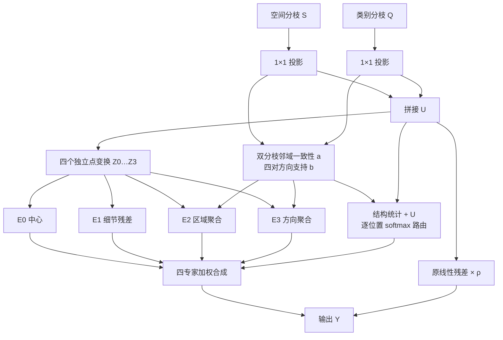

# DualFeatureMoE 遥感结构感知融合修改策略

日期：2026-09-26。适配对象：iSAID、OpenAI CLIP ViT-B/16、双教师、semantic KL 蒸馏配置。

**实施状态：** 已按本策略接入 `RSStructureDualFeatureMoE`，并新增 [iSAID KL 结构融合配置](/Users/leopold/Developer/open/PCA-Seg-Remote/configs/clip_vitb_384_isaid_attr64_semantic_kl_rs_structure.yaml)。完成了 Python／Shell 语法和 YAML 继承的静态核对；按要求未在本机运行模型测试、训练或性能测量。下文保留设计依据、实现约定和服务器验证计划，论文未改动。

## 1. 推荐方案

**建议将多尺度卷积专家改为“中心保留、局部细节、区域一致性、方向连续性”四种功能专家，并用空间／类别两分枝的邻域一致性控制融合。** 工作名称为 **RSStructureDualFeatureMoE**，中文称“遥感结构感知双特征融合”。

四个专家保留原来的独立通道变换能力，将末端空间卷积改为分组点投影，再分别施加明确的局部结构算子。区域与方向专家按当前类别的局部特征决定邻居贡献；所有方向共享规则，适应俯视图中缺少固定朝向的地物。

预算按原版四个 3×3 专家的 DualFeatureMoE 对齐。C=128 时，新方案每模块 **341,160 参数**，原版 **349,221 参数**，减少约 **2.31%**；新增邻域运算使用省下的空间卷积预算。主要算术量的解析估算接近原版，详细口径见第 6 节。

用户目前确认的是**总体 mIoU 下降**，尚无按类别、尺度或边界拆分的结果。因此，“跨地物混合”“细节减弱”“门控选择不足”均是诊断假设。下面给出的是本项目提出的可实施候选结构，提升幅度由服务器实验确定。

## 2. 当前实现对设计的约束

### 2.1 融合的实际对象

当前 [DualFeatureMoE 实现](/Users/leopold/Developer/open/PCA-Seg-Remote/cat_seg/modeling/transformer/model.py:547) 接收两路 `[B,C,T,H,W]` 特征：

- S：空间聚合分枝的输出。
- Q：类别聚合分枝的输出。
- T：候选类别数。两路均为类别条件特征，T 不是时间、方向或属性数。

两路特征已由 Swin／Class Transformer 处理，分辨率相同，也不对应传统 FPN 的“浅层高分辨率／深层低分辨率”特征。融合卷积将 B、T 合并为 batch；按类别共享参数，保持可变词表接口。

原版每个专家为：

```text
Conv1×1(2C → 2C)
→ SyncBatchNorm(2C)
→ GELU
→ GroupConv3×3(2C → C, groups=C)
→ GELU
```

末端每组读取 2 个通道、输出 1 个通道。前置 1×1 已混合两个分枝，因此这两个通道不再分别代表空间与类别特征。全部四个专家均执行，随后进行逐类别、逐位置的 softmax 加权。

[当前 KL 配置](/Users/leopold/Developer/open/PCA-Seg-Remote/configs/clip_vitb_384_isaid_attr64_semantic_kl.yaml:1) 已启用 `[1,3,5,7]`。该继承链的 C=128、网格为 24×24、聚合层数为 2，每层有 first／second 两个融合位置，合计 **4 个独立融合模块**。

### 2.2 为什么不再优先扩大卷积核

现有多尺度改造改变的是采样范围，门控仍仅从融合前特征生成权重，没有显式描述邻域是否跨越地物、是否存在连续细长结构。更大核提供上下文的同时，也增加混合不同区域的机会；这条风险在密集、小型目标上尤其值得检查。

此外，24×24 网格上的 7×7 窗口并不对应原图 7×7 像素。384 输入、16 像素 patch 步长下，它覆盖更宽的 token 邻域；上游已有注意力和卷积，不能把窗口大小等同于整个模块的真实感受野。

新方案将改造重点放在**邻居是否应该参与、应按区域还是按方向参与**。新增局部算子均使用 3×3 邻域，长距离语义继续由已有注意力分枝提供。

## 3. 文献依据与项目适配

下表采用论文正文或作者来源。论文支持对应机制与任务动机；最后一列是针对当前接口和预算的设计判断。

| 相关工作 | 论文提供的依据 | 本项目的具体适配 |
|---|---|---|
| [iSAID，CVPR Workshops 2019，摘要／图 1](https://openaccess.thecvf.com/content_CVPRW_2019/papers/DOAI/Zamir_iSAID_A_Large-scale_Dataset_for_Instance_Segmentation_in_Aerial_Images_CVPRW_2019_paper.pdf) | 航拍目标密集，具有大量微小目标、任意朝向、较大长宽比及显著尺度差异 | 中心通路保护孤立响应；对称方向通路服务桥梁、船舶等延伸结构。道路用于具有该标签的跨数据集评估，不能当作 iSAID 的训练类别 |
| [OVRS，2024，§III-B／III-C](https://arxiv.org/html/2409.07683v1) | 将多方向图像特征对齐后融合，并通过多层特征上采样处理尺度变化 | 当前工程已有四方向编码，新增模块在特征层对方向共享参数，避免引入固定水平／垂直偏好；不额外重复运行骨干 |
| [LSKNet，ICCV 2023，§3.3／表 4](https://arxiv.org/html/2303.09030v2) | 遥感检测受益于按位置选择上下文；论文消融中感受野过小或过大均影响效果 | 借鉴位置相关的上下文选择，改为类别条件的邻域一致性权重。其检测结果不直接证明本项目中大核融合有效 |
| [FreqFusion，TPAMI 2024，§IV](https://arxiv.org/html/2408.12879v1) | 将区域内不一致与边界细节不足区分处理，使用自适应低通、高通和重采样组件 | 提取“区域一致性与局部细节需要不同处理”的原则，设计同分辨率残差专家。当前两分枝没有高低分辨率关系，故不移植其完整上采样结构 |
| [Semantic Diffusion Network，2023，§4.1–4.2](https://arxiv.org/html/2302.02057v1) | 利用语义引导的邻域相似性调节局部信息传播，构造语义差分算子 | 在每个候选类别内，分别计算 S、Q 各自的邻域相似性，构造单次归一化聚合；增加相反方向成对支持，且不使用迭代扩散或学习型空间差分核 |
| [PCA-Seg，2026，§3.2–3.3](https://arxiv.org/html/2603.17520v1) | EPL 以独立专家和逐位置系数融合并行分枝；FOD 降低两分枝冗余 | 保留双分枝入口、密集专家混合和融合前 FOD；将专家的差异落实为遥感结构操作 |
| [RSKT-Seg，§RS-CMA／RS-Fusion／RS-Transfer](https://arxiv.org/html/2509.12040v1) | 在遥感开放词汇分割中联合多方向代价图、空间／类别聚合和遥感知识迁移 | 在现有旋转、属性与教师协议内单独替换融合模块，保持开放词表和推理时的教师独立性 |

本方案的项目适配集中在三个位置：**类别条件的双分枝邻域关系、方向成对支持、原专家预算内的功能划分**。高通残差、相似性加权与专家软混合已有研究基础，不能单独作为原创机制；上述组合的独立贡献需要消融结果支持。

## 4. 目标结构与公式

### 4.1 输入投影与四个点变换

将 B、T 合并，令 N=BTHW。沿用原投影：

\[
s=P_s(S),\qquad q=P_q(Q),\qquad U=[s;q].
\]

s、q 的形状为 `[BT,C,H,W]`，U 为 `[BT,2C,H,W]`。每个专家先计算独立的中心特征：

\[
Z_e=\operatorname{GELU}\left(
\operatorname{GConv}_{1\times1}^{2C\to C,\;G=C}
\left[\operatorname{GELU}\left(\operatorname{SyncBN}
\left(W_e^{1\times1}U\right)\right)\right]\right).
\]

其中 \(W_e:2C\to2C\)，e∈{0,1,2,3}。四套参数独立；不共享原本占主要预算的通道变换。

**结构变化：** 原专家末端的学习型 3×3 空间核，变为分组 1×1 点投影与下文的内容相关局部操作。它同时改变专家处理方式及路由依据，不再按核大小给专家分工。

### 4.2 双分枝邻域一致性

在每个位置 p 的八邻域 \(\mathcal{N}_8\) 上计算权重。默认只用当前学生特征，不读取教师、标签或类别编号。

先对 s、q 的通道向量分别作 L2 归一化：

\[
\bar{s}_p=\frac{s_p}{\max(\|s_p\|_2,\epsilon)},\qquad
\bar{q}_p=\frac{q_p}{\max(\|q_p\|_2,\epsilon)}.
\]

对于偏移 \(\delta\in\mathcal{N}_8\)：

\[
d^s_\delta(p)=
\frac{1-\operatorname{clip}(\bar{s}_p^\top\bar{s}_{p+\delta},-1,1)}{2},
\qquad
d^q_\delta(p)=
\frac{1-\operatorname{clip}(\bar{q}_p^\top\bar{q}_{p+\delta},-1,1)}{2},
\]
\[
a_\delta(p)=
\exp\left(-\frac{d^s_\delta(p)+d^q_\delta(p)}{2\tau}\right).
\]

默认 \(\tau=0.1,\epsilon=10^{-6}\)。a 的形状为 `[BT,8,H,W]`，每个候选类别分别计算；两分枝任意一路的邻域差异增大，邻居贡献都会下降。

这里比较的是**同一分枝内部两个位置**，没有计算 s 与 q 的直接差异。当前 FOD 鼓励两分枝正交，直接把 `|s-q|` 或跨分枝余弦当作“不可靠度”会混淆互补性与误差。

a 表示隐特征的局部一致性，不是“同类概率”或已校准置信度。默认对生成 a 与路由统计的 s、q 使用 `detach()`，让分割梯度经 U、专家和原残差更新主路径，减少训练早期对邻域权重的直接操纵，并节省该统计路径的反向缓存。

### 4.3 四种功能专家

定义 \(B_3(Z)\) 为 3×3 均值算子。将八邻域组成四对：

\[
\mathcal{D}=\{(0,1),(1,0),(1,1),(1,-1)\},
\qquad
b_d(p)=a_d(p)a_{-d}(p).
\]

每个 \(b_d\) 同时要求相反两侧具有支持。所有 d 使用同一公式，不为某个绝对方向设置独立权重。

区域聚合为：

\[
R_a(Z)_p=
\frac{Z_p+\sum_{\delta\in\mathcal{N}_8}a_\delta(p)Z_{p+\delta}}
{1+\sum_{\delta\in\mathcal{N}_8}a_\delta(p)}.
\]

方向成对聚合为：

\[
L_a(Z)_p=
\frac{Z_p+\sum_{d\in\mathcal{D}}b_d(p)
\frac{Z_{p+d}+Z_{p-d}}{2}}
{1+\sum_{d\in\mathcal{D}}b_d(p)}.
\]

两者均包含固定权重为 1 的中心项，分母始终不小于 1。全部邻域支持很弱时，结果回到中心特征附近。

| 专家 | 输出定义 | 面向遥感的作用 |
|---|---|---|
| E0：中心保留 | \(F_0=Z_0\) | 保留当前位置响应，给密集小目标和不可靠邻域提供一条无需新增空间混合的路径 |
| E1：局部细节 | \(F_1=Z_1+\alpha_1[Z_1-B_3(Z_1)]\) | 加入局部变化残差，补充目标轮廓、局部对比及狭小结构信息 |
| E2：区域一致性 | \(F_2=Z_2+\alpha_2[R_a(Z_2)-Z_2]\) | 根据当前类别的邻域关系聚合同一区域，减少无选择地混合邻近地物 |
| E3：方向连续性 | \(F_3=Z_3+\alpha_3[L_a(Z_3)-Z_3]\) | 利用相反方向的共同支持，沿桥梁、船舶等延伸结构传播局部响应 |

三个幅度参数分别学习：

\[
\alpha_j=0.5\,\sigma(\theta_j),\quad
\theta_j^{(0)}=\log(0.2/0.8),\quad \alpha_j^{(0)}=0.1.
\]

区域／方向专家的空间更新始终保留至少一半的原中心项；细节增强幅度同样有界。E1 也可能增强纹理，所以由路由器结合两分枝统计决定其贡献，不能将高频响应直接解释为真实边界。

这些算子提供功能上的偏置。是否学到可用的专家分工，要通过权重分布、输出差异和消融验证。

### 4.4 结构统计参与路由

从已有距离与权重提取四个标量图：

\[
D(p)=\left[
\operatorname{mean}_{\delta}d^s_\delta,\;
\operatorname{mean}_{\delta}d^q_\delta,\;
\operatorname{mean}_{\delta}a_\delta,\;
\max_d b_d-\min_d b_d
\right].
\]

四项分别描述空间分枝局部变化、类别分枝局部变化、邻域支持程度、方向支持差异。它们都在 [0,1] 内；最后一项避免除以很小的方向响应而放大噪声。

将原门控的第一层输入从 2C 扩为 2C+4：

\[
g=\operatorname{softmax}_e
\left(W_{g2}\operatorname{ReLU}(W_{g1}[U;D])\right),
\qquad
Y=\sum_{e=0}^{3}g_eF_e+\rho P_r(U).
\]

仍使用 r=4 的隐藏宽度 d=C/4；\(P_r:2C\to C\) 和可学习 \(\rho\) 保持原实现，\(\rho^{(0)}=0.5\)。g 为 `[BT,4,H,W]`。门控不硬编码“边界一定选 E1”或“车辆一定选 E0”，而是利用连续统计学习选择。

初始化时，将门控新增的 4 个输入通道权重置零，其余部分沿用原初始化规则；结构统计随后通过门控参数学习参与融合。最终输出恢复 `[B,C,T,H,W]`。

### 4.5 模块示意



### 4.6 方向与词表性质

八邻域闭合于 90° 旋转，四组相反方向共享规则，统计只做对称归约，点投影不区分空间方向。因此，在统一 padding 下，**该融合模块对输入特征的 90° 旋转应满足等变关系**：

\[
F(\mathcal{R}_{90}S,\mathcal{R}_{90}Q)
=\mathcal{R}_{90}F(S,Q).
\]

这是一项模块级结构性质：输出随特征一起旋转。整网仍包含骨干与其他聚合算子，任意角度的旋转鲁棒性及整网性能需要另外评估。

模块各项计算均按 T 共享参数，不使用类别编号、固定类别输出层或沿 T 的新增 softmax。类别重排应使输出作相同重排。训练阶段原 SyncBN 仍跨 BT 汇总统计，保留这一行为。

## 5. 实施约定与 KL 蒸馏接入

### 5.1 数值与实现细节

1. 邻域统一采用 `replicate` padding；所有距离、均值和成对取样使用同一边界约定。用 padding 加切片实现位移，避免 `torch.roll` 将图像两边错误连接。
2. 距离、指数、权重分母和描述子 D 在 FP32 中计算；再按专家特征 dtype 使用权重。均值／加权求和采用稳定的归约方式，避免由广播意外产生 `[BT,C,8,H,W]` 的全量缓存。
3. a、b 每个融合模块只计算一次，区域专家、方向专家和路由器复用。四个模块各自使用自身输入，不能跨层复用旧权重图。
4. 对 E2、E3 采用逐偏移累加或等价融合算子；不为四个专家分别展开 3×3 全通道 `unfold`。训练显存仍受自动求导缓存影响，需在服务器测量。
5. 保留原 SyncBN、GELU、残差形式和四专家数量。第一版使用原 ModuleList 执行方式，算子打包作为后续等价工程优化。
6. α 的上界为 0.5，默认起点 0.1；τ 首版固定为 0.1。只在训练域验证集上检查 0.05／0.1／0.2 三档 τ，避免把结构失败变成无边界的调参。
7. 输入尺寸、dtype、设备、B/C/T/H/W 必须一致。指导分枝使用 `detach()`；U 和四个点变换保留梯度。

以下为接口伪代码；辅助函数由第 4 节公式和上述 padding 约定完整定义：

```python
def forward(spatial_feat, class_feat, batched_inputs=None):
    s = spatial_proj(fold_class_into_batch(spatial_feat))
    q = class_proj(fold_class_into_batch(class_feat))
    u = cat([s, q], dim=1)

    # FP32; normalized within each branch, independently for every class.
    a, b, descriptors = neighborhood_statistics(
        s.detach(), q.detach(), tau=0.1, padding_mode="replicate"
    )
    weights = gate(cat([u, descriptors.to(u.dtype)], dim=1))

    fused = 0
    for i, point_expert in enumerate(point_experts):
        z = point_expert(u)
        if i == 0:
            f = z
        elif i == 1:
            f = z + alpha[0] * (z - mean3x3(z))
        elif i == 2:
            f = z + alpha[1] * (region_average(z, a) - z)
        else:
            f = z + alpha[2] * (paired_direction_average(z, b) - z)
        fused = fused + weights[:, i:i + 1] * f

    fused = fused + res_scale * residual(u)
    return restore_class_dimension(fused)
```

### 5.2 实施接入位置

| 文件／入口 | 修改要求 |
|---|---|
| [rs_structure_dual_feature_moe.py](/Users/leopold/Developer/open/PCA-Seg-Remote/cat_seg/modeling/transformer/rs_structure_dual_feature_moe.py) | 独立实现新模块与邻域算子，接口保持 `forward(S,Q,batched_inputs=None) -> Tensor` |
| [cat_seg/config.py](/Users/leopold/Developer/open/PCA-Seg-Remote/cat_seg/config.py:101) | 注册 `FEATURE_FUSION.RS_STRUCTURE_MOE`，加入 τ、α 上界／初值及指导特征 detach 开关 |
| [CATSegPredictor.from_config](/Users/leopold/Developer/open/PCA-Seg-Remote/cat_seg/modeling/transformer/cat_seg_predictor.py:192) | 把新配置传入 `feature_fusion_cfg`，确保配置确实进入工厂 |
| [build_feature_fusion](/Users/leopold/Developer/open/PCA-Seg-Remote/cat_seg/modeling/transformer/model.py:624) | 新增 `rs_structure_dual_feature_moe` 分支；旧类型保持可复现实验的实现 |
| [AggregatorLayer](/Users/leopold/Developer/open/PCA-Seg-Remote/cat_seg/modeling/transformer/model.py:691) | 核对 first／second、两层合计 4 处全部构建新模块；沿用普通密集融合返回路径 |
| [clip_vitb_384_isaid_attr64_semantic_kl_rs_structure.yaml](/Users/leopold/Developer/open/PCA-Seg-Remote/configs/clip_vitb_384_isaid_attr64_semantic_kl_rs_structure.yaml) | 继承当前 KL 配置，再覆盖融合类型和独立输出目录 |
| [训练脚本](/Users/leopold/Developer/open/PCA-Seg-Remote/scripts/train_semantic_kl_2gpu.sh:23) | 复用 CONFIG 入口；启动信息显示配置文件，实际融合类型见训练保存的最终合并配置 |

新配置的主要内容如下；配置注册和工厂接入均已完成：

```yaml
_BASE_: clip_vitb_384_isaid_attr64_semantic_kl.yaml
MODEL:
  SEM_SEG_HEAD:
    FEATURE_FUSION:
      TYPE: "rs_structure_dual_feature_moe"
      RS_STRUCTURE_MOE:
        TAU: 0.1
        CORRECTION_MAX: 0.5
        CORRECTION_INIT: 0.1
        DETACH_GUIDANCE: true
OUTPUT_DIR: "output/isaid_clip_vitb_semantic_kl_rs_structure"
```

父配置保留的 `MULTISCALE_MOE.KERNEL_SIZES` 只服务旧类型，新类型不读取它。模块宽度 C 和层数继续由原聚合器控制。

### 5.3 与当前训练协议的关系

首轮保留当前 KL 配置中的 RemoteCLIP `SAME_GRID=true`、768×768 教师输入、temperature=2、logit_scale=10、KL 权重 4e-3；保留 RSDINO 蒸馏权重 1.6e-5、OpenAI attr64、RS prompts、四方向编码、batch=8、学习率 2e-4、60,000 步。

当前 [KL 损失路径](/Users/leopold/Developer/open/PCA-Seg-Remote/cat_seg/cat_seg_model.py:593) 对学生图像特征与教师区域语义分布计算蒸馏。新模块在下游聚合中工作，不把教师输出引入其 forward，也不新增教师推理依赖。

FOD 继续位于融合前，聚合端权重保持 0.001。首轮不添加边界损失、专家均衡损失或额外旋转训练损失；用相同目标比较结构的作用。

新模块的空间核与门控输入形状均有变化，应从相同预训练骨干重新训练融合头。旧 3×3 或 `[1,3,5,7]` 融合 checkpoint 不作为新结构的完整恢复点，原生 `strict=False` 也不解决同名参数的形状冲突。

将修改后的代码和新配置同步到服务器后，可通过现有脚本分别启动新方案和原版对照：

```bash
# 新方案：使用独立输出目录开始新的训练。
CONFIG=configs/clip_vitb_384_isaid_attr64_semantic_kl_rs_structure.yaml \
OUTPUT_DIR=output/isaid_kl_rs_structure_seed0 \
bash scripts/train_semantic_kl_2gpu.sh iSAID SEED 0

# 原版对照：继承同一 KL 协议，仅恢复原版融合类型。
CONFIG=configs/clip_vitb_384_isaid_attr64_semantic_kl.yaml \
OUTPUT_DIR=output/isaid_kl_original_moe_seed0 \
bash scripts/train_semantic_kl_2gpu.sh iSAID \
MODEL.SEM_SEG_HEAD.FEATURE_FUSION.TYPE dual_feature_moe SEED 0
```

脚本会用 OUTPUT_DIR 环境变量覆盖 YAML 中的输出目录，实验时显式指定。两个命令按服务器资源顺序运行。

## 6. 与原版相当的计算预算

### 6.1 统一核算口径

E=4，d=floor(C/4)，N=BTHW。MAC 指乘加，1 MAC 按 2 FLOPs 换算。以下首先统计主要卷积，随后单独计入新增邻域运算；双方共有的归一化、激活、原 softmax、偏置加法和最终专家混合不在主卷积表内。

原版主要卷积量与可训练参数：

\[
M_0/N=20C^2+72C+2Cd+4d,
\]
\[
P_0=20C^2+72C+2Cd+4d+31C+d+5.
\]

新方案把四个分组空间核从 9 个位置改成 1 个位置，省下 64C 权重／每位置 MAC；门控多出 4d 权重／MAC，另增加 3 个幅度参数：

\[
M_1^{conv}/N=20C^2+8C+(2C+4)d+4d,
\]
\[
P_1=P_0-64C+4d+3.
\]

BN 运行统计为 buffer，不计入可训练参数；固定邻域算子不增加训练参数。

| C=128、d=32，单模块 | 原版 3/3/3/3 | 当前 1/3/5/7 | 本方案 |
|---|---:|---:|---:|
| 可训练参数 | 349,221 | 361,509 | **341,160** |
| 每位置主卷积 MAC | 345,216 | 357,504 | **337,152** |
| 相对原版参数变化 | — | +3.52% | **−2.31%** |

### 6.2 新增邻域计算不能漏算

按每个 `(b,t,h,w)` 位置核算，以下数量为标量算术操作估算，乘和加分别计 1：

| 操作 | 约计标量运算 |
|---|---:|
| s、q 通道归一化 | 6C，另 2 次开方 |
| 两分枝各 8 个邻居的点积 | 32C |
| E1 的 3×3 均值 | 9C |
| E2 的中心加权区域均值 | 17C |
| E3 的四对方向均值 | 17C |
| 三个专家的残差校正 | 9C |
| 权重、分母、4 个统计等 | O(1)，另 8 次指数 |

线性项合计约 90C。为给标量归约和边界实现留余量，方案预算按 **96C+512** 估计，即 C=128 时约 **12,800 次普通标量操作**；还应另外记录指数、开方、比较以及每模块 3 次 sigmoid。

据此，主卷积加新增普通算术的参考值为：

- 原版：`2 × 345,216 = 690,432` 次／位置。
- 本方案：`2 × 337,152 + 12,800 ≈ 687,104` 次／位置。

该估算说明新增机制处于原模块同一预算内。上述 99.5% 的比值不是精确总 FLOPs 比值，也不是延迟结果；指数、访存、类型转换、小算子调度和反向传播需由实现后的 profiler 补全。

B=1、T=15、H=W=24、4 个模块时，原版主卷积约 **11.931 GMAC（23.861 GFLOPs）**；新方案主卷积约 **11.652 GMAC**，加新增普通算术后约 **23.746 GFLOPs**。这只是融合部分，不是整网；推理时应按实际候选 T 和网格尺寸重算。

### 6.3 工程预算与表达能力取舍

理论阶数继续为 \(O(BTHWC^2)\)，邻域补充为 \(O(BTHWC)\)，没有新增 \(T^2\) 或 \((HW)^2\) 项，也没有额外骨干运行。四模块参数合计由 1,396,884 变为 **1,364,640**。

实现验收目标为：相同统计口径下模块计算量不高于原版 5%；同服务器、相同精度及输入下，融合耗时和整网训练峰值显存分别以不高于原版 10% 为工程目标。后两项是验收阈值，不是已测结论。

代价是移除了各专家可独立学习的空间核，换取方向共享、输入相关的结构操作。如果固定局部规则限制表达能力，新的 mIoU 可能仍低于原版；第 7 节用点投影对照判断这项取舍，避免将所有变化都归因于路由。

## 7. 服务器实验与决策顺序

### 7.1 先确认原版对照和下降范围

检查原版与多尺度实验保存的最终配置、初始化、训练步数、随机种子、评估数据、resize／滑窗、词表、属性库及 best／last checkpoint 选择规则。优先使用同一 KL 配置切换 `FEATURE_FUSION.TYPE` 获得原版对照。

现有本地历史记录不足以确认本次多尺度退化的具体部位。先补齐总体 mIoU、逐类别 IoU、混淆矩阵和固定样本可视化，再判断边界、小目标或跨数据集问题是否存在。

### 7.2 最小实验组合

| 编号 | 配置 | 要回答的问题 |
|---|---|---|
| B0 | 原版 DualFeatureMoE，四个 3×3 | 同 KL 协议下的有效基线 |
| M0 | 现有 `[1,3,5,7]` | 记录此次退化；协议一致时可复用已有结果 |
| P0 | 新点投影专家，四路均直接输出 Z，使用原 2C 门控，不加结构统计与校正 | 单独移除学习型空间核带来多大变化 |
| R0 | 完整 RSStructureDualFeatureMoE | 整体策略能否超过 B0 |

P0 可直接复用已有 `multi_scale_dual_feature_moe` 类型，把 `MULTISCALE_MOE.KERNEL_SIZES` 设为 `[1,1,1,1]`，无需另写一个点投影对照模块。

先以同一个种子完成 B0、P0、R0 的筛选；若 R0 有优势，再以至少 3 个配对种子比较 B0、R0。统计平均 mIoU、标准差及每个种子的差值，不能用新方案 best 对原版 last。

通过筛选后，再按需要实施以下单项消融：

| 消融 | 与 R0 的唯一区别 | 解释目标 |
|---|---|---|
| 区域关系消融 | 聚合中的 a、b 全置 1；路由仍使用原始 D | 数据相关邻域是否优于固定局部均值 |
| 方向成对消融 | E3 的 \(L_a\) 换成 \(R_a\)，其余不变 | 相反方向共同支持是否有独立作用 |
| 细节消融 | 令 E1 输出 Z1 | 高频残差是否带来有效信息 |
| 路由统计消融 | 门控保留 2C+4 输入宽度，但 D 置零 | 性能是否来自显式结构统计 |

消融开关关闭的专有可学习参数应冻结或从优化器中移除，避免 DDP 未使用参数问题。不要给密集专家强行增加均匀负载约束，平均权重均匀并不代表有效分工。

### 7.3 与遥感任务对应的诊断

- **主指标：** 原实验协议的总体 mIoU 与逐类别 IoU。跨数据集采用既定统一协议，报告各数据集结果，不能只选提升项。
- **小目标：** 有实例标注时按真实实例面积分层；只有语义掩码时按同类连通域分层，并注明这是连通域指标。面积阈值由训练域统计预先确定。
- **边界：** 在最终预测分辨率上评估，固定边界容差和 ignore 区域处理；可报告 1／2／4 像素容差下的 Boundary F1，双方使用完全一致的规则。
- **细长结构：** 优先看 iSAID 的桥梁、船舶等类别及长宽比较高的组件；道路类仅在含该标签的目标数据集检查，不能将 DLRSD 的 pavement 自动等同于 road。
- **邻域有效性：** 统计同标签邻居与异标签邻居的平均 a，并记录 a 的直方图；若 a 几乎全为 1 或全接近 0，该引导尚未形成有效选择。低分辨率标签采用固定映射规则；对混合类别 token 单独统计，避免把混合 token 强行当作可靠语义指导。
- **方向：** 固定样本旋转后对齐预测，比较原版与新方案的整网一致性，并单独验证模块的 90° 等变误差。任意角度测试需统一插值与标签处理。
- **路由：** 记录专家平均权重、区域内／边界附近的权重、路由熵、α 和专家输出 RMS；同时看输出幅度，不能仅凭 gate 大小判定贡献。

原网格中已丢失的亚 token 目标细节无法由这个模块直接恢复。若错误主要来自目标在编码阶段消失，应转向高分辨率指导或解码器研究，而不是继续加重融合专家。

### 7.4 功能与预算验收

这些检查均安排在服务器；本机只维护本方案文档：

1. 形状与梯度：覆盖 B=1、实际每卡 batch、T=1／15／17／实际推理上限，确认输出形状、有限值和主路径梯度。
2. 常量特征：局部高频项应为零，区域和方向平均应保持常量。检查 padding 处没有假边界。
3. 构造局部输入：模拟孤立点、同质块、水平／垂直／斜向细线，检查 a、b 与中心保留规则。它验证算子定义，不代替精度实验。
4. 对特征输入作类别重排及 90° 旋转，比较对应重排／旋转后的输出；eval FP32 下建议相对误差阈值 1e-5，并记录数值后端。
5. 统计四个模块参数；核对 **每模块 341,160、总计 1,364,640**，前提为 C=128、d=32、默认三标量幅度参数。
6. profiler 同时覆盖卷积、邻域运算、归约、指数、类型转换与布局操作；记录 forward、forward+backward、峰值显存、整网吞吐。
7. 延迟测试保持相同设备、软件、精度、batch、T 和分辨率，预热并同步 GPU，报告中位数。若算术量接近但延迟超标，先合并邻域算子和减少重复缓存。

**采用标准：** R0 在配对实验中稳定改善主 mIoU，并满足预算；遥感分组指标与消融用于解释收益。若收益只来自单次波动，或新邻域规则持续劣于原版，就保留 B0，不继续通过叠加模块掩盖当前方案的问题。

## 8. 实施优先级

第一步补齐原版同协议对照及下降诊断；第二步实现本文件中唯一的默认结构，完成模块正确性与预算检查；第三步运行 B0／P0／R0；通过后再做多种子和单项消融。

本次修改的核心研究问题是：**在固定的双分枝融合预算内，类别条件的邻域一致性与方向成对支持，能否比无结构约束的卷积混合更好地保留遥感目标。**
